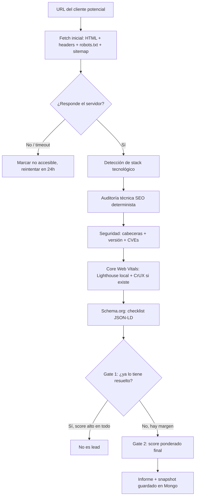
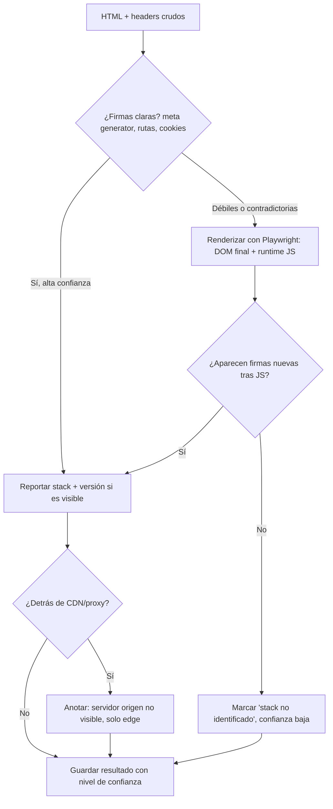
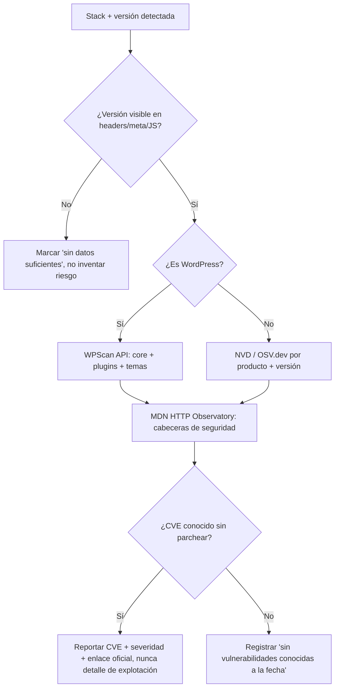
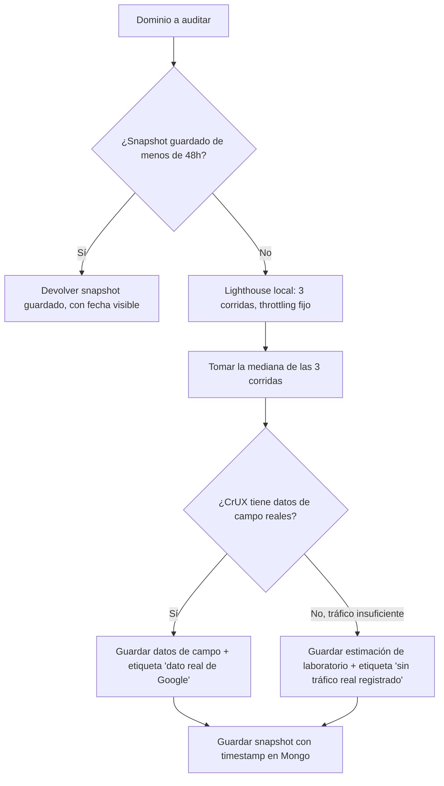
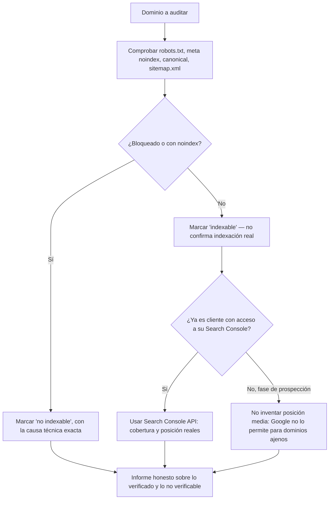

# Motor de auditoría determinista — diseño y casuística
## 0. Principio rector
Cero LLM en el cálculo del score. Cualquier número que salga del motor tiene que poder explicarse con una fórmula o un checklist, no con "el agente lo decidió así". Donde el rendimiento real tenga variación inevitable (Core Web Vitals), el determinismo se consigue con snapshots guardados, no fingiendo que una medición en vivo siempre da lo mismo. Donde no exista una fuente de datos honesta (posición media en Google de un dominio ajeno), el informe lo dice explícitamente en vez de inventar una cifra.
---
## 1. Qué guardar, qué dividir, qué tirar (mapeo del recon)
| Módulo actual | Qué es hoy | Qué hacer | Estado |
|---|---|---|---|
| `citability_scorer.py` | Fórmula matemática pura sobre bloques de texto (5 pesos) | Mantener tal cual, ya es Python puro | ✅ Guardar |
| `geo-technical` | `fetch_page.py` ya hace estimación estática determinista, pero el subagente "inyecta la nota" de CWV | Portar los 8 pesos de la rúbrica existente (SSR 25%, meta/indexabilidad 15%, rastreabilidad 15%, seguridad 10%, riesgo CWV 10%, móvil 10%, URLs 5%, estado 5%) a una función Python pura; sustituir la estimación estática de CWV por Lighthouse real | ✅ Portar a Python puro |
| `geo-schema` | 12 validaciones puntuales sobre JSON-LD, "auditadas por el subagente" pero la lógica es un checklist | Validador Python puro: parsear JSON-LD + comprobar propiedades. No necesita LLM en ningún punto | ✅ Portar a Python puro |
| `geo-content` (E-E-A-T) | Flesch y frescura de fechas (deterministas) + juicio sobre credenciales del autor (subjetivo, LLM) | Guardar Flesch (librería `textstat`) y frescura de fechas; reducir la parte de autoría a un check binario: ¿hay nombre de autor y fecha visibles? sí/no | ⚠️ Dividir |
| `geo-brand-mentions` | Wikipedia/Wikidata (consulta a API, determinista) + LinkedIn/Reddit/YouTube (juicio del LLM) | Guardar las consultas a Wikipedia/Wikidata; eliminar o dejar fuera del score el resto | ⚠️ Dividir |
| `geo-llmstxt` | Genera/valida `llms.txt`, lo marca como problema de prioridad alta si falta, estima "+8 puntos de visibilidad IA" sin base verificable | Eliminar del score por completo. Google confirmó oficialmente en junio de 2026 que no lo usa para nada | ❌ Eliminar |
| `geo-platform-optimizer` | Juicio cualitativo puro sobre si el contenido "encaja" con ChatGPT/Perplexity/AI Overviews | No es automatizable de forma determinista y fiel a lo que realmente evalúan esas plataformas | ❌ Eliminar del score |
La fórmula actual (`Citability 25% + Brand 20% + EEAT 20% + Technical 15% + Schema 10% + Platform 10%`) pierde entre el 40% y el 55% de su peso con estos cambios — no es un parche, hay que rediseñarla desde cero con lo que quede.
---
## 2. Herramientas de terceros que sustituyen al LLM
| Categoría | Herramienta | Notas |
|---|---|---|
| Core Web Vitals | **Lighthouse** (paquete npm `lighthouse`, open source de Google) ejecutado en local vía Playwright, + **CrUX API** para datos de campo reales cuando existan | Es el mismo motor que usa PageSpeed Insights. Corriéndolo tú, no hay límite diario de peticiones — el límite es tu propio hardware |
| Detección de stack | **`wappalyzer-next`** (`pip install wappalyzer`) | El Wappalyzer original pasó a ser de pago; este proyecto reutiliza las mismas firmas (WordPress, Shopify, frameworks JS, etc.) vía Playwright/Chromium |
| Cabeceras de seguridad | **MDN HTTP Observatory API** (`observatory-api.mdn.mozilla.net`) | Gratis, sin registro, 1 escaneo/minuto por host con caché automática. También instalable en local |
| CVEs en WordPress | **WPScan API** | 25 peticiones/día gratis, de sobra para prospección diaria. Ojo: la licencia gratuita es para uso no comercial — para una agencia, revisar sus planes de pago |
| CVEs en otros stacks | **NVD** (National Vulnerability Database) u **OSV.dev** (Google) | Gratuitas y oficiales, consulta por producto + versión |
| Indexabilidad técnica | Comprobación propia: `robots.txt`, meta `noindex`, canonical, `sitemap.xml` | Ya lo hace `fetch_page.py`, 100% determinista |
| Indexación real / posición media | No existe alternativa gratuita fiable para dominios ajenos | Ver sección 4 |
---
## 3. Diagramas de flujo
### 3.1 Pipeline general (sin IA en ningún punto)

### 3.2 Detección de stack tecnológico

Casuística que resuelve este diagrama: sitios con tema/CMS de base pero frontend headless custom encima, SPAs sin SSR donde las firmas solo aparecen tras ejecutar JS, builds minificados/ofuscados sin fingerprints reconocibles, y sitios detrás de Cloudflare donde no puedes ver el servidor de origen real.
### 3.3 Seguridad y versiones desactualizadas

Regla explícita para este módulo: el informe reporta que existe una CVE sin parchear, su severidad y el enlace a la fuente oficial. Nunca genera ni almacena pasos de explotación — eso convierte una herramienta de venta en una herramienta de ataque, y además varios de vuestros clientes potenciales lo verían (con razón) como una señal de alarma en vez de confianza.
### 3.4 Core Web Vitals con determinismo real

### 3.5 Indexación — límites honestos

---
## 4. Los dos límites que no se resuelven con ingeniería
**Rendimiento y Core Web Vitals tienen variación real de una corrida a otra.** Ni el propio Google mide con una sola muestra — usa el percentil 75 sobre 28 días de tráfico real (CrUX). Ninguna herramienta os va a dar el mismo número exacto si relanzáis la medición en vivo dos veces. La solución no es perseguir un determinismo que no existe en la realidad, es guardar el snapshot con fecha: si preguntáis por la misma empresa mañana, el sistema devuelve el informe guardado en vez de remedir. Eso sí cumple el objetivo real — reproducibilidad del informe, no de la medición física.
**No existe API gratuita y legítima para la posición media en Google de un dominio que no es vuestro.** Google prohíbe explícitamente la comprobación programática de indexación para propiedades no verificadas en Search Console. Las únicas vías reales son pagar un servicio de terceros que hace scraping de SERPs de forma legal en su propia infraestructura (SerpApi, DataForSEO y similares, con coste por consulta), o tener acceso a la Search Console del cliente — que solo llega después de cerrar el trato. En fase de prospección, lo único ofrecible con certeza es indexabilidad técnica (robots.txt, noindex, canonical, sitemap), que es distinto de indexación confirmada, y el informe debe decirlo así de claro.
